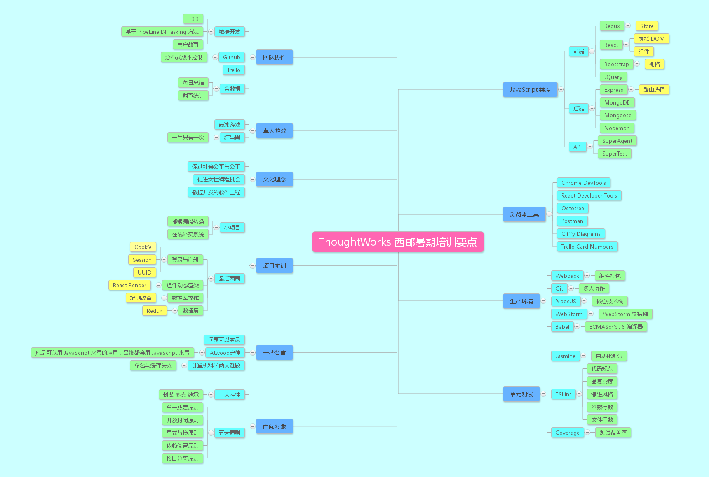
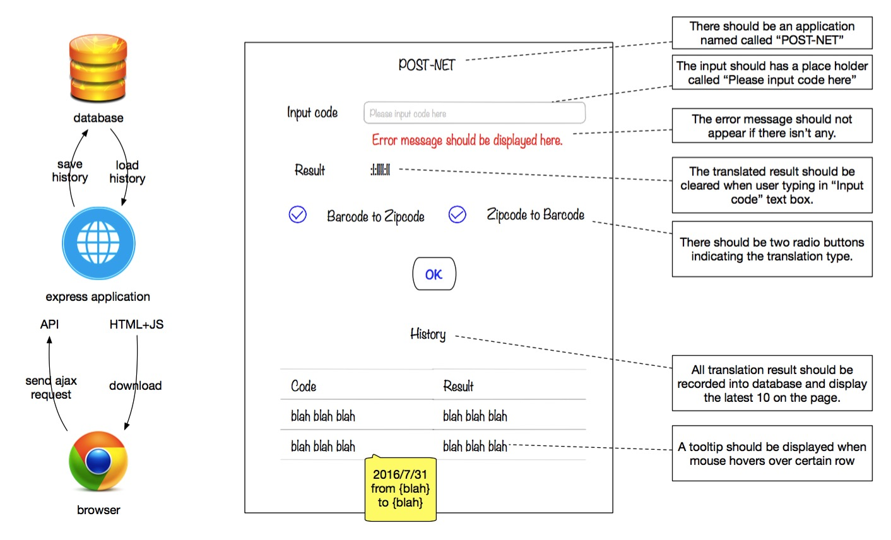
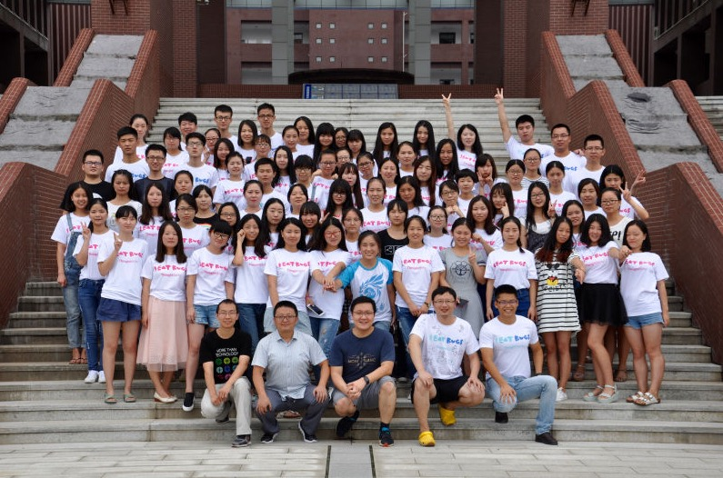

# ThoughtWorks-XUPT2016-Programming

> [一分钟了解 ThoughtWorks](http://mp.weixin.qq.com/s?__biz=MzA4MjU3Mzg0MA==&mid=400967040&idx=3&sn=3c7d64f4feb039131f2829880651e08c&scene=1&srcid=0910Hcs566ODiOxDZeO84Rvc#rd)

> [我要去印度参加一场精神与世界的狂欢！](http://mp.weixin.qq.com/s?__biz=MzI0MDUyNDAxMQ==&mid=2247483759&idx=1&sn=35f5938c8c313c12e580d521a9fdfbd8&scene=2&srcid=0909JGNPut7fNuJYmfTIbY71#rd)

## ThoughtWorks 西安邮电大学暑期特训营（2016）训练集

[ThoughtWorks 西安邮电大学暑期特训营（2016）报名点](https://jinshuju.net/f/rHT9Fo)

[ThoughtWorks 暑期特训营在线笔试题](http://academy.thoughtworks.cn/)

> 同学您好，感谢您报名并参与2016年ThoughtWorks西安邮电大学暑期特训营线上测试。很高新的通知您，您已成功通过测试！具体名单可前往位于计算机学院IT实训中心的卓越女生实验室门口查看，我们在后续几周内会持续向您更新后续事宜。

就这样开启了软件工程非凡之旅。

暑期培训时间为2016年 7.18~8.26 每周6天，每天7+小时。

付之以该仓库的文章分享戳 -- [一场有趣的 TDD 编程之旅](http://www.jianshu.com/p/afd0de46ae9d)

## 六周培训要点脑图

## 项目训练



这六周断断续续从以下仓库克隆过,学习过,大部分都是 ThoughtWorks 老师写的。

||||
|-------|--------|-------|-------|
|[dojo](https://github.com/hkliya/dojo)|[pre-pos](https://github.com/twa-camp/pre-pos)|[postnet](https://github.com/linwenjun/postnet)|
|[take-out-food](https://github.com/freewind/take-out-food)|[webpack-base](https://github.com/react-redux-practise/webpack-base)|[big-class-test-2](https://github.com/twa-camp-2016/big-class-test-2)|
|[collection-calculate-camp](https://github.com/iamcoach/collection-calculate-camp)|[postnet-base-for-big-class-room](https://github.com/twa-camp-2016/postnet-base-for-big-classroom)|[pendding-demo-use-async-action](https://github.com/react-redux-practise/pendding-demo-use-async-action)|
|[login-demo](https://github.com/react-redux-practise/login-demo)|[recruiting-system](https://github.com/thoughtworks-academy/recruiting-system)||

## 仓库目录介绍

enter-examination

    ThoughtWorks西邮暑期特训营 -- JavaScript在线笔试题

framework-learning

    框架学习概要(Jasmine, Express, BootStrap, React等)

javascript-learning

    JavaScript 学习笔记

pos-basics-train

    第一周 pos 机的基础训练

project-train

    展示了我们小组的项目截图,对于其他小组想要加入记录的可以 Fork 本仓库并将自己的网站内容写到一个 Markdown 文件中并保存至 project-train 目录中进行 Pull Request

week-summary

    每周周末汇总

## 经典的 Tasking 图和原型图

## ThoughtWorks 推荐电子文档

[Linux 新手指南](http://thoughtworks-academy.github.io/linux-guide/zh-hans/)

[推荐书籍](https://github.com/iamcoach/books)

[js oo 训练](https://github.com/iamcoach/oo-basic-step-by-step)

[git 基础知识](https://github.com/iamcoach/git)

[操作系统背景知识和发展历程介绍](https://github.com/iamcoach/os-intro)

## ThoughtWorks 西邮暑期结营合影

> 永不说再见。。

## 鸣谢

感谢 ThoughtWorks 老师们，还有各位学长学姐们这整个暑假的热情陪伴。
